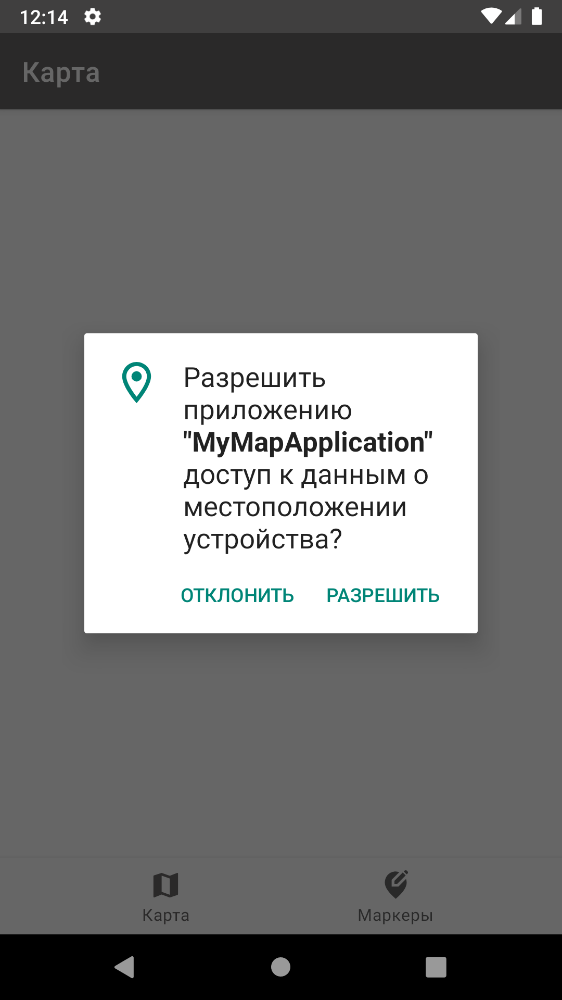
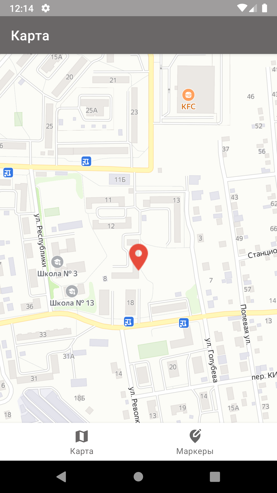
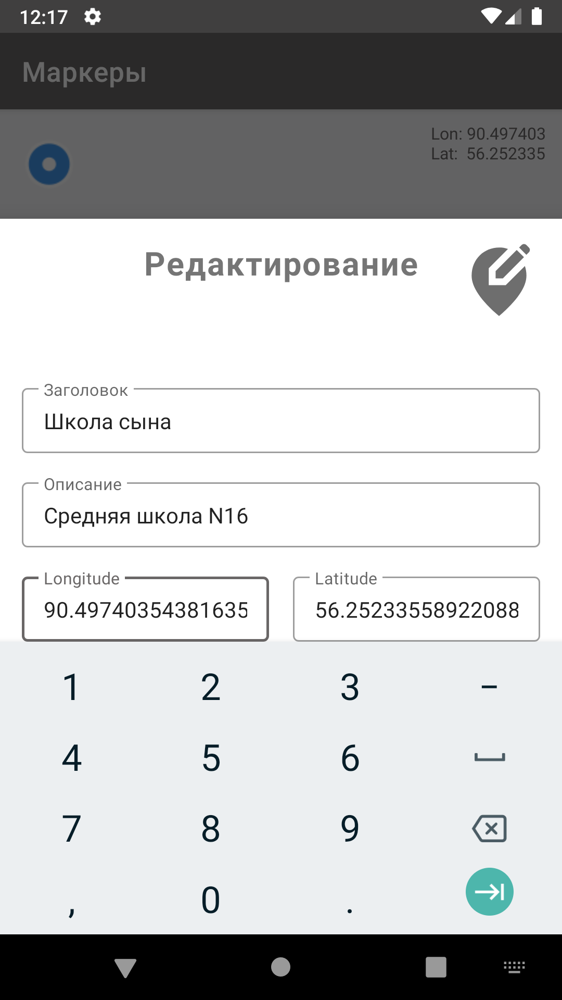
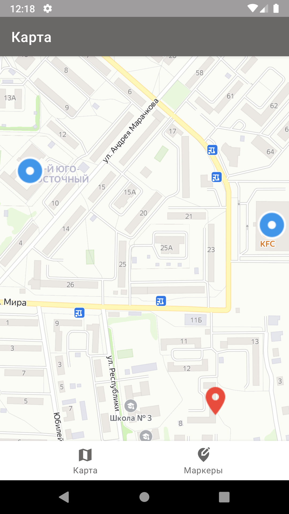
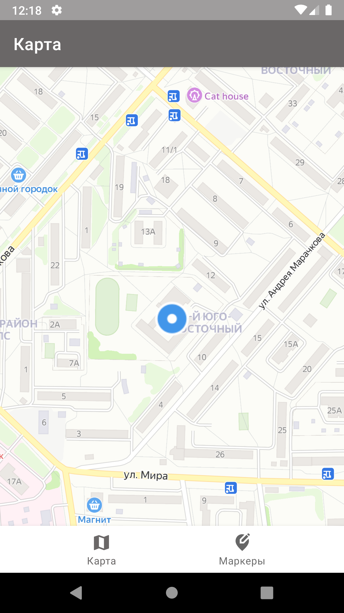

# Факультет: Android-разработки Курс: Подготовка к собеседованию Android-разработчика

### Домашние задания:
---
### Домашнее задание №1
- Создать приложение с основным экраном в виде карты и следующими требованиями:
  * Приложение должно находить устройство по геолокации.
  * На карте можно ставить маркеры.
  * На отдельном экране можно посмотреть и отредактировать список маркеров, добавить к маркеру название и аннотацию.
  * Выбор архитектуры и библиотек остается за вами.
- Рассказать про Singleton, и почему иногда его называют антипаттерн

---

